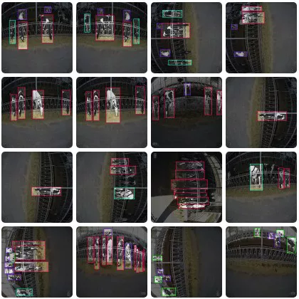
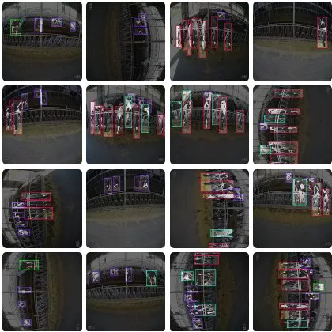

# YOLO-based Detection dataset for cattle

## Body

YOLO (You Only Look Once) is a deep learning-based object detection algorithm that can detect objects in real-time. It uses a convolutional neural network to classify the input image into different categories. The YOLO dataset is a collection of images with labeled bounding boxes around the detected objects.

(Full product description was not available from the source page.)

## Images

## Payment

Here is a pay link on Stripe ( https://buy.stripe.com/3cs8yP7sY87d0vu9AB ). Please contact me lonlonago@foxmail.com after funding $89, and I will send you a complete data files , thank you!

